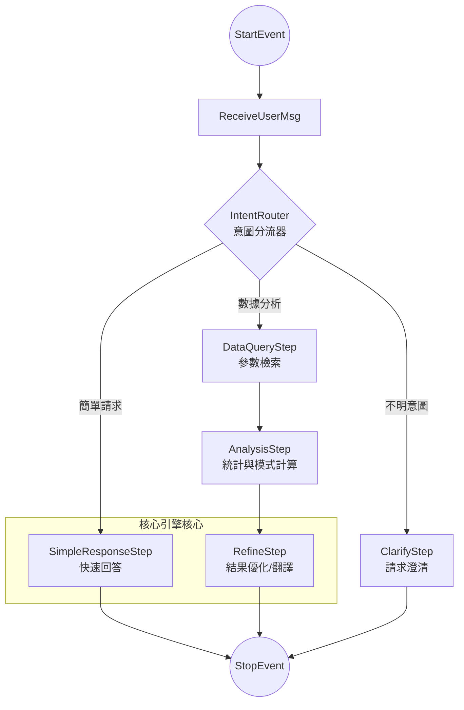
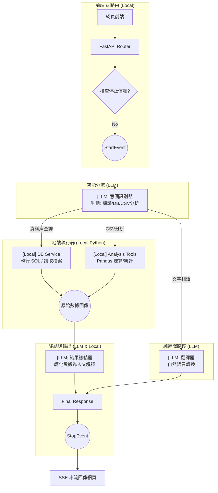

# LlamaIndex Workflow 設計原則與結構圖

本文檔解釋了為什麼 **LlamaIndex Workflow** 不會導致「無限多的 Workflow」，以及它如何優雅地處理從簡單到複雜的不同任務。

## 1. 核心原則：萬能中控塔 (The Router Pattern)

Workflow 的本質不是一條直線，而是一個由 **事件 (Event)** 驅動的網絡。對於您的系統，我們建議採用 **「單一 Workflow，動態分流」** 的設計。

### 結構圖 (Mermaid)



---

## 2. 解決您的疑慮：為什麼不會有無窮的 Workflow？

### A. 它是「具備多種能力的單一實體」
您不需要為「翻譯」寫一個 Workflow，為「分析」寫另一個。如上圖所示，所有的行為都寫在**同一個類別**中。它像一個「交通轉運站」：
- 如果用戶說「請翻譯 X」，Event 會直接跳轉到 `SimpleResponseStep`。
- 如果用戶說「分析 A 欄位」，Event 會引導走過 `Query -> Calc -> Refine`。
- **中間的步驟會被自動跳過**，不會增加複雜度。

### B. 步驟重用 (Step Reuse)
許多步驟是通用的。例如 `RefineStep` (將數據轉化為繁體中文) 可以同時服務於「統計結果」和「異常檢測結果」。您只需要定義一組穩定的生產工具。

### C. 單一入口點
不論流程變得多複雜，對於您的核心程式碼來說，永遠只有：
```python
# 無論內部跑幾步，外部調用始終如一
result = await analysis_workflow.run(user_input="分析數據...")
```

---

## 3. Workflow vs. 目前的 ReActAgent

| 特性 | ReActAgent (現狀) | Workflow (願景) |
| :--- | :--- | :--- |
| **運作模式** | AI 盲目循環，隨機性高。 | 事件驅動節點，路徑完全可預測。 |
| **穩定度** | 容易發生無限遞歸，需額外加裝計數器。 | **天然防護**。每個轉向都必須有明確的 Event 對接。 |
| **可觀察性** | 難以追蹤 AI 到哪一步。 | **視覺化追蹤**。可以清晰看到 Event 在哪個節點停留。 |
| **停止機制** | 需手動在循環中「插樁」檢查。 | **框架內建**。可在節點切換時統一處理中斷信號。 |

## 4. 實務面實作架構 (Practical Implementation)

在 Workflow 中，我們可以清晰地定義哪些步驟需要 **耗費 Token 的 LLM**，哪些是 **純地端的 Python 運算**。這能極大提高系統的可預測性。

### 實務流程圖 (LLM vs. Local)



---

## 5. 模組分工說明

| 模組名稱 | 類型 | 負責內容 |
| :--- | :--- | :--- |
| **IntentStep** | **LLM (Ollama)** | 決定這是哪一類問題。確保「翻譯」不會跑去「算統計」。 |
| **DBStep** | **Local Python** | 直接調用 SQLAlchemy 或 Python 檔案系統。**保證數據安全**，不把原始檔案丟給 AI。 |
| **CSV/AnalysisStep** | **Local Python** | 執行 Pandas 運算。這是 LlamaIndex 模組的最強項，AI 只負責下指令。 |
| **TransStep** | **LLM (Ollama)** | 只有單純的文字轉換需求會經過這裡。 |
| **Summarize** | **LLM (Ollama)** | 把工程師看的 JSON 數據「說人話」翻譯成繁體中文給用戶。 |

---

## 6. 這種架構的實務優點

1.  **資料庫安全**：AI 只在 `IntentStep` 下決定要查什麼，真正的查詢是在 `DBStep` (地端代碼) 執行的。我們**不允許** LLM 直接連接資料庫，而是由 Workflow 的 Step 進行隔離。
2.  **效能極致**：如果用戶只是要「翻譯」，它只會經過 2 次 LLM 調用（意圖 + 翻譯），完全不啟動 Pandas 或 DB 模組。
3.  **錯誤回溯**：如果數據算錯了，我們可以百分之百確定是 `CSVStep` 的 Pandas 邏輯問題，而不是 AI 亂編答案（Hallucination），因為運算過程是純 Python。

---

| 步驟名稱 (Step) | 驅動方式 | 職職說明 | 關聯工具/函數數量 |
| :--- | :--- | :--- | :--- |
| **StartStep** | Local | 接收 API 請求、初始化 Session 與記憶。 | 0 |
| **RouteIntent** | **LLM** | 意圖分流，具備多輪對話理解能力。 | 1 (LLM 判斷) |
| **ExecuteAnalysis** | Local | 執行地端 Pandas 運算。具備**搜尋結果檢查**機制。 | **18 個** 工具 |
| **ExpandConcept** | **LLM** | **[自主糾錯]** 若搜尋無效，自動聯想技術術語並重試。 | 1 (LLM 聯想) |
| **ExecuteTranslation**| **LLM** | 處理純文字翻譯或一般聊天。 | 1 (LLM 處理) |
| **Humanizer** | **LLM** | 將 JSON 數據轉為繁體中文，並負責 Chart JSON 生成。 | 3 (Helper Tools) |
| **FinalStop** | Local | 輸出 StopEvent，完成 SSE 串流封裝。 | 0 |

---

## 8. 自主糾錯機制：語義擴展循環 (Semantic Expansion)

這是您系統最先進的特性：**「不輕易言敗」**。

當用戶搜尋「斷紙」而地端資料庫只有英文欄位（如 `PaperBreak`）時，傳統 Agent 會直接回報「找不到」。
而我們的 Workflow 具備以下邏輯：

1.  **偵測結果**：在 `ExecuteAnalysis` 步驟中檢查 `total_matches` 是否為 0。
2.  **觸發糾錯**：若為 0 且屬首次嘗試，拋出 `ConceptExpansionEvent`。
3.  **大腦聯想**：進入 `ExpandConcept` 工作站，LLM 利用其備份的造紙專家知識，將「斷紙」聯想為 `Paper Break`, `WEB_BREAK`, `MedBreak` 等。
4.  **自動重試**：帶著新關鍵字回到 `ExecuteAnalysis` 重新搜尋。
5.  **成功總結**：原本找不到的資料，現在能被精準定位。

---

## 8. 數據統計與效能優勢

- **LLM 調用次數**：
  - 簡單翻譯/聊天：僅需 **2 次** LLM 串聯。
  - 複雜數據分析：僅需 **2-3 次** LLM 串聯 (意圖 + 總結)。
- **地端工具總量**：系統目前已準備 **18 個** 高效 Python 工具供 Workflow 調配。
- **架構特點**：
  - **運算與生成分離**：複雜的 Pandas 運算 (DataAnalysis) 發生在地端，完全不消耗 LLM 的推理時間與 Token 成本，這保證了系統的 **回應速度** 與 **經濟性**。
  - **精準度控制**：因為運算步驟是固定的 Python 代碼，保證了 100% 的數學準確度，避開了 LLM 算數不準的缺點。

---

## 9. 如何實作：一個類別，包辦所有步驟

您的困惑非常正確：這 8 個步驟**不是** 8 個分開的檔案或獨立的系統，它們全部都封裝在 **同一個 Python 類別 (Class)** 裡面。

您可以想像成這是一間 **「自動化代工廠」**：
- **Workflow 類別** = 這間工廠的大樓。
- **Step (步驟)** = 大樓內的各個工作站。
- **Event (事件)** = 工作站之間的輸送帶。

### 實際代碼結構示意 (Python)

這就是您未來會寫出的代碼樣子，這**就是一個檔案**：

```python
class SigmaAnalysisWorkflow(Workflow):
    
    @step
    async def start_station(self, ev: StartEvent) -> IntentEvent:
        # 步驟 1: 接收問題，拋出意圖事件
        return IntentEvent(query=ev.query)

    @step
    async def router_station(self, ev: IntentEvent) -> AnalysisEvent | TranslateEvent:
        # 步驟 2: LLM 決定分流。如果是翻譯，就丟給翻譯事件；如果是數據，就丟給分析事件
        if "翻譯" in ev.query:
            return TranslateEvent(...)
        return AnalysisEvent(...)

    @step
    async def analysis_station(self, ev: AnalysisEvent) -> SummarizeEvent:
        # 步驟 3: 地端 Python (Pandas) 運算，完成後丟給總結事件
        result = self.pandas_tool.run(...)
        return SummarizeEvent(data=result)

    # ... 其他步驟依此類推 ...

    @step
    async def final_station(self, ev: SummarizeEvent) -> StopEvent:
        # 最後一步: 整理繁體中文，工廠出口
        return StopEvent(result="分析完成...")
```

---

## 10. 為什麼要這樣「串起來」？ (核心優勢)

1.  **您不需要寫複雜的 `if/else`**：
    您不需要寫「如果 A 成功就做 B，否則做 C」，您只需要定義每一個工作站「看到什麼零件（Event）就動手」。LlamaIndex 會自動幫您把路徑接通。
    
2.  **單一控制台**：
    雖然內部有 8 個工作站，但對您的 API 來說，您永遠只需下一個指令：
    `await workflow.run(input="幫我分析這張表")`。

3.  **錯誤與停止控制**：
    如果工廠發生意外（循環、出錯、或您按了停止），我們只需要在工廠的「中央控制室」（Workflow 循環中）按一下紅燈，所有的工作站都會立刻停下來，這就是為什麼它比 Agent 更穩定。

---

## 12. 擴展指南：如何新增一個分析演算法？

這是 Workflow 最強大的地方：**如果您要新增一個演算法（例如「預測未來趨勢」），您只需要執行簡單的兩步：**

### 第一步：在地端工具包新增演算法 (Local Tool)
在 `backend/services/analysis/tools/` 下新增一個 Python 類別，寫好您的數學運算邏輯（例如使用 Scikit-learn）。這部分是純 Python，**完全不涉及 AI**，保證速度與穩定。

### 第二步：在 Workflow 類別新增一個「工作站」 (Step)
回到您的 `SigmaAnalysisWorkflow` 類別中，新增一個幾行代碼的函數即可：

```python
    @step
    async def prediction_station(self, ev: PredictionEvent) -> SummarizeEvent:
        # 新增的工作站：執行預測演算法
        raw_data = await self.db.get_data(...)
        prediction_result = self.my_new_algo.execute(raw_data) # 調用在地端寫好的演算法
        
        # 處理完後，依然拋出「總結事件」，讓 AI 幫您解釋結果
        return SummarizeEvent(data=prediction_result)
```

---

## 13. 對比：為什麼比現在更容易擴展？

- **現在 (ReAct Agent)**：如果您加了一個複雜工具，您需要祈禱 AI 「懂得」如何正確組合參數去調用它，有時候它會調用失敗或跳不出循環。
- **未來 (Workflow)**：
    - 您可以透過 `Router` **強制**規定：如果用戶問到「預測」，就一定會流向您的 `prediction_station`。
    - 流程是**可見且可控的**。您可以確保新演算法執行前，數據已經過濾完成，執行後，結果一定會被傳給總結模組。

## 15. 名詞解釋：用『自動化工廠』一語言之

為了讓您不再被名詞搞混，我們用一個 **「自動化代工廠」** 來對應這些技術術語：

| 技術名詞 | 工廠類比 | 實務上的意義 |
| :--- | :--- | :--- |
| **Workflow** | **整間工廠大樓** | 這是最外層的 **Python 類別 (Class)**。它把所有東西關在裡面，維持系統穩定。 |
| **Step**<br/>(Station) | **獨立的工作站** | 這是類別裡的 **一個函數 (Method)**。例如「翻譯站」、「計算站」。 |
| **Event** | **自動輸送帶** | 這是站與站之間傳遞的 **資料包**。它決定了下一個工作站是誰。 |
| **Tool / ToolCall** | **特殊的加工機器** | 這是已經寫好的 **工具代碼** (如：Pandas、SQL)。工作站會去「按動機器」來達成目的。 |

### 把它們串起來的邏輯：
1.  您啟動 **Workflow** (工廠開門)。
2.  傳入一個問題，觸發 `StartEvent` (原材料上傳送帶)。
3.  **Step** 看到 `StartEvent` 就動手處理，處理完拋出下一個 `Event`。
4.  最後一個 **Step** 拋出 `StopEvent` (成品出廠)。

---

## 17. 深度解析：Step 內部如何使用 Tool 傳遞 Event？

您的理解已經非常接近核心了！讓我們把行為拆解得更精準一點：

### 核心觀點：Step 是「管理者」，Tool 是「工人」

1.  **Step 內部可以有很多 Tool**：
    一個步驟（工作站）不一定只用一個工具。例如「分析工作站」可以先跑 `統計工具`，拿到結果後，再接著跑 `圖表工具`。
2.  **Tool 跑完不直接傳到下一個 Step**：
    工具（Tool）只是純函數，它跑完會把結果還給 Step。
3.  **Event 是由 Step 最後拋出的**：
    當 Step 把所有需要的工具都跑完了、數據整理好了，它才會把成品放上「事件傳送帶 (Event)」，通知下一個 Step 動手。

### 代碼示意：一個 Step 呼叫多個 Tool

```python
    @step
    async def comprehensive_analysis_station(self, ev: AnalysisEvent) -> SummarizeEvent:
        # Step 開始運作：
        
        # 1. 呼叫工具 A (在地端跑)
        stat_result = self.stats_tool.execute(ev.data)
        
        # 2. 呼叫工具 B (根據 A 的結果繼續在地端跑)
        pattern_result = self.pattern_tool.execute(stat_result)
        
        # 3. 收集完所有工具的結果，打包成 Event 傳給下一步
        final_data = {"stats": stat_result, "patterns": pattern_result}
        
        return SummarizeEvent(data=final_data) # 這裡才是這一步的終點
```

---

## 18. 為什麼這樣比 Agent 更穩定？

在 **Agent (現狀)** 中，AI 是邊跑工具邊想下一步。如果不小心工具結果太多，AI 可能會混亂。

在 **Workflow (未來)** 中：
- **穩定運算**：Step 內部的工具呼叫是 **「確定性」** 的。您可以規定這個站就是要跑這兩個工具，AI 無法反悔。
- **乾淨傳遞**：傳送到下一個 Step 的 `Event` 是經過整理的乾淨數據，不會帶入無用的廢話，讓後面的 LLM 總結起來更精準。

---

## 20. 路由靈活性：路徑是『寫死』的還是『動態』的？

這是 Workflow 最美妙的地方：**您可以自由決定哪些地方要「嚴格執行」，哪些地方要「交給 AI 靈活判斷」。**

### A. 固定的 SOP 路徑 (Fixed Path)
對於極端穩定的功能（如：存檔、發送通知），您可以規定 `Step A` **百分之百**流向 `Step B`。這保證了流程絕對不會出錯。

### B. 條件分流路徑 (Conditional Branching)
就像工廠裡的「品檢站」，根據檢測結果決定去向：
- **邏輯分流 (Python)**：如果數據大於 100，拋出 `WarningEvent`；否則拋出 `NormalEvent`。
- **意圖分流 (LLM)**：由 LLM 決定現在是要「去查資料庫」還是「去翻譯句子」。

### C. 並行與匯總 (Parallel & Combined)
一個 Step 可以同時拋出 **多個 Event**。
*   例如：一邊去算「平均值」，另一邊去跑「異常檢測」。這兩個工作站會 **同時開始跑**，最後彙總到一個「總結站」。

### 代碼示意：靈活的拋出事件

```python
    @step
    async def smart_router(self, ev: IntentEvent) -> DBEvent | CSVEvent | ChatEvent:
        # 這裡就是您可以控制的地方：
        
        if ev.target == "database":
            return DBEvent(...)  # 走向資料庫分支
        elif ev.target == "csv":
            return CSVEvent(...) # 走向 CSV 分支
        else:
            return ChatEvent(...) # 走向純翻譯/聊天分支
```

---

## 21. 總結：這是您的「智慧地圖」

改成 Workflow 後，您不是在寫一條死板的直線，而是在設計一張 **「智慧導航圖」**：
1.  **關鍵路口由您掌控**：您可以強制規定某些核心步驟的順序。
2.  **彈性分支由 AI 填空**：在您允許的範圍內，給予 AI 選擇路徑的自由。

這就是為什麼我說它能滿足您的 **「最高穩定度」**：因為所有的路徑（Highway 或 Alley）都是在地圖上的，AI 不可能跑出地圖之外去發生無限迴圈。

---

## 22. 最終總結
改成 Workflow **並不是**要您去寫 8 個分開的小程式，而是將原本散亂的邏輯，裝進一個 **「條理分明、有標準作業程序 (SOP)」** 的大箱子裡。

這樣做最大的好處是：即便未來功能增加到 20 個步驟，您的主程式依然只會看到一個整潔的 Workflow，維護起來非常輕鬆。
